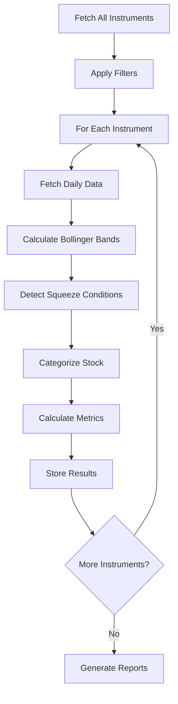

# Volatility Squeeze Analyzer - Complete Code Walkthrough
## Understanding the Trading System Architecture

---

## 📋 Table of Contents
1. [System Overview](#system-overview)
2. [Architecture Design](#architecture-design)
3. [Core Components Deep Dive](#core-components-deep-dive)
4. [Data Flow & Processing](#data-flow--processing)
5. [Analysis Phases](#analysis-phases)
6. [Key Algorithms](#key-algorithms)
7. [Usage Examples](#usage-examples)
8. [Performance Considerations](#performance-considerations)

---

## 🎯 System Overview

### What is Volatility Squeeze?
A **volatility squeeze** occurs when a stock's price movement becomes very narrow (low volatility) after a period of wider movement. This consolidation typically precedes significant price breakouts or breakdowns.

### The Trading Strategy
1. **Identify** stocks in low volatility periods (squeeze) in Daily chart. This will be depends on different timeframe, So considering timeframe is a must!
2. **Categorize** them based on their position relative to optimal trading ranges
3. **Analyze** historical performance to predict breakout direction
4. **Generate** actionable trading signals

---

## 🏗️ Architecture Design

### Layered Architecture
```
┌─────────────────────────────────────────────────────────────┐
│                    MAIN EXECUTION FLOW                      │
├─────────────────────────────────────────────────────────────┤
│  PHASE 4: Performance Profiling & Backtesting              │
├─────────────────────────────────────────────────────────────┤
│  PHASE 3: Individual Stock Analysis                        │
├─────────────────────────────────────────────────────────────┤
│  PHASE 2: Universe Analysis & Categorization               │
├─────────────────────────────────────────────────────────────┤
│  PHASE 1: Data Fetching & Validation                       │
├─────────────────────────────────────────────────────────────┤
│                    CONFIGURATION & SETUP                   │
└─────────────────────────────────────────────────────────────┘
```

### Core Classes & Responsibilities

| Class | Purpose | Key Methods |
|-------|---------|-------------|
| `ConfigurationManager` | Central configuration hub | Manages all parameters |
| `DatabaseManager` | Database operations | `connect()`, `execute_query()` |
| `DataFetcher` | Data retrieval & filtering | `get_all_instruments()`, `get_instrument_data()` |
| `VolatilityAnalyzer` | Main analysis orchestrator | `analyze_universe()`, `analyze_instrument()` |
| `BollingerBandCalculator` | Technical indicators | `calculate_bollinger_bands()` |
| `SqueezeDetector` | Squeeze detection logic | `detect_squeeze()`, `categorize_stock()` |
| `IndividualAnalyzer` | Detailed stock analysis | `analyze_individual_stock()` |
| `BacktestEngine` | Historical performance | `backtest_squeeze_strategy()` |

---

## 🔍 Core Components Deep Dive

### 1. Configuration Management
```python
class ConfigurationManager:
    def __init__(self):
        # Database settings
        self.db_config = {...}
        
        # Trading parameters
        self.trading_params = {
            'bb_period': 20,           # Bollinger Bands period
            'bb_std_dev': 2.0,         # Standard deviations
            'lookback_period': 126,    # Historical analysis days
            'check_period': 5,         # Recent squeeze check days
            'min_price': 10.0,         # Minimum stock price
            'min_avg_volume': 100000,  # Minimum volume filter
            'exclusions': [...],       # ETFs and non-stocks to exclude
            'blacklist': [...]         # Specific symbols to skip
        }
```

**Key Insight**: All parameters are centralized, making the system highly configurable and testable.

### 2. Data Layer Architecture
```python
class DataFetcher:
    def get_all_instruments(self) -> List[Dict]:
        # 1. Fetch all instruments with daily data
        # 2. Apply exclusion filters (ETFs, indices, etc.)
        # 3. Apply blacklist filters
        # 4. Return clean instrument list
    
    def get_instrument_data(self, instrument_key: str) -> Optional[pl.DataFrame]:
        # 1. Fetch OHLCV data from database
        # 2. Apply data quality filters
        # 3. Validate price/volume consistency
        # 4. Return clean DataFrame
```

**Data Quality Filters**:
- Minimum data days (126 days)
- Positive OHLC prices
- Logical OHLC relationships
- Minimum price and volume thresholds
- Gap detection (>5 days missing data)

### 3. Bollinger Bands Calculation
```python
class BollingerBandCalculator:
    def calculate_bollinger_bands(self, df: pl.DataFrame) -> pl.DataFrame:
        bb_period = 20
        bb_std_dev = 2.0
        
        # Calculate moving average and standard deviation
        df = df.with_columns([
            pl.col("close").rolling_mean(bb_period).alias("bb_mid"),
            pl.col("close").rolling_std(bb_period).alias("bb_std")
        ])
        
        # Calculate upper and lower bands
        df = df.with_columns([
            (pl.col("bb_mid") + bb_std_dev * pl.col("bb_std")).alias("bb_upper"),
            (pl.col("bb_mid") - bb_std_dev * pl.col("bb_std")).alias("bb_lower")
        ])
        
        # Calculate BBW (Bollinger Band Width)
        df = df.with_columns([
            ((pl.col("bb_upper") - pl.col("bb_lower")) / pl.col("bb_mid")).alias("bb_width")
        ])
```

**BBW Formula**: `(Upper Band - Lower Band) / Middle Band`
- **Low BBW** = Tight bands = Low volatility = Potential squeeze
- **High BBW** = Wide bands = High volatility = Active trading

---

## 🔄 Data Flow & Processing

### Step-by-Step Analysis Flow



### 1. Instrument Discovery
```python
# SQL Query for instrument discovery
query = """
SELECT DISTINCT scd.instrument_key, su.symbol, su.name
FROM stock_candle_data scd
JOIN stock_universe su ON scd.instrument_key = su.instrument_key
WHERE scd.time_interval = 'day'
"""
```

### 2. Data Filtering Pipeline
```python
# Exclusion filters applied sequentially
for exclusion in config.trading_params['exclusions']:
    df = df[~df['symbol'].str.contains(exclusion, case=False)]
    df = df[~df['name'].str.contains(exclusion, case=False)]

# Additional quality filters
df = df[df['symbol'].str.len() >= 3]  # Minimum symbol length
df = df[~df['symbol'].str.match(r'^[A-Z]{2,5}$')]  # Remove indices
```

### 3. Squeeze Detection Logic
```python
def detect_squeeze(self, df: pl.DataFrame) -> Optional[Dict]:
    # 1. Calculate 10th percentile threshold from historical data
    percentile_10_threshold = lookback_df.select(
        pl.col("bb_width").quantile(0.10)
    ).item()
    
    # 2. Check if recent BBW is below threshold
    recent_days_df = df.tail(check_period)
    low_vol_days = recent_days_df.filter(
        pl.col("bb_width") <= percentile_10_threshold
    )
    
    # 3. Calculate squeeze metrics
    squeeze_ratio = latest_bb_width / avg_bb_width_lookback
    volume_ratio = recent_volume / historical_volume
    breakout_readiness = (latest_close - bb_lower) / bb_range
```

---

## 📊 Analysis Phases

### Phase 1-2: Universe Analysis
**Purpose**: Scan entire market for squeeze candidates

```python
def analyze_universe(self) -> List[Dict]:
    # 1. Get all instruments
    instruments = self.data_fetcher.get_all_instruments()
    
    # 2. Analyze each instrument
    results = []
    for instrument in instruments:
        result = self.analyze_instrument(
            instrument['instrument_key'], 
            instrument['symbol']
        )
        if result:
            results.append(result)
    
    # 3. Categorize results
    category_a = results_df.filter(pl.col("category") == "A")  # In optimal range
    category_b = results_df.filter(pl.col("category") == "B")  # About to enter
    category_c = results_df.filter(pl.col("category") == "C")  # Other squeezes
```

### Phase 3: Individual Analysis
**Purpose**: Deep dive into specific stocks

```python
def analyze_individual_stock(self, instrument_key: str, symbol: str, df: pl.DataFrame) -> Dict:
    # 1. Historical context analysis
    bbw_percentiles = self._calculate_historical_percentiles(historical_df)
    
    # 2. Contraction confirmation
    contraction_analysis = self._analyze_contraction_confirmation(df_with_bb)
    
    # 3. Tradable range analysis
    tradable_range_analysis = self._analyze_tradable_range(df_with_bb)
    
    # 4. Performance profile
    performance_profile = self._generate_performance_profile(df_with_bb)
```

### Phase 4: Performance Profiling
**Purpose**: Historical backtesting and optimization

```python
def generate_performance_profile(self, instrument_key: str, symbol: str, df: pl.DataFrame) -> Dict:
    # 1. Run backtest
    backtest_result = self.backtest_engine.backtest_squeeze_strategy(df, symbol)
    
    # 2. Find optimal range
    optimal_range = self.range_optimizer.find_optimal_bb_range(df, symbol)
    
    # 3. Generate profile summary
    profile_summary = self._generate_profile_summary(backtest_result, optimal_range)
```

---

## 🧮 Key Algorithms

### 1. Stock Categorization Algorithm
```python
def categorize_stock(self, current_bbw: float, optimal_range: Dict, bbw_trend: Dict) -> str:
    optimal_min = optimal_range["optimal_range_min"]
    optimal_max = optimal_range["optimal_range_max"]
    trend_direction = bbw_trend["trend_direction"]
    
    # Category A: Currently in optimal BBW range
    if optimal_min <= current_bbw <= optimal_max:
        return "A"
    
    # Category B: About to enter optimal range (contracting and approaching)
    if trend_direction == "CONTRACTING" and current_bbw > optimal_max:
        return "B"
    
    # Category C: Other cases
    return "C"
```

### 2. Optimal Range Calculation
```python
def calculate_optimal_bb_range(self, df: pl.DataFrame) -> Dict:
    # Use last 252 days (1 year) for optimal range calculation
    historical_df = df.tail(252)
    bbw_series = historical_df.select("bb_width").to_series()
    
    # Find the shortest range with highest win rate
    percentile_10 = bbw_series.quantile(0.10)
    percentile_25 = bbw_series.quantile(0.25)
    
    return {
        "optimal_range_min": percentile_10,
        "optimal_range_max": percentile_25,
        "optimal_range_avg": (percentile_10 + percentile_25) / 2
    }
```

### 3. Backtesting Algorithm
```python
def _identify_squeeze_entries(self, df: pl.DataFrame) -> List[Dict]:
    entries = []
    
    for i in range(lookback_period, len(df) - 5):
        # Get historical context
        historical_df = df.slice(i - lookback_period, lookback_period)
        current_bbw = df.slice(i, 1).select("bb_width").item()
        
        # Calculate threshold
        threshold = historical_df.select(pl.col("bb_width").quantile(0.10)).item()
        
        # Check squeeze condition
        if current_bbw <= threshold:
            # Additional confirmation: BBW declining
            recent_bbw = df.slice(i-5, 5).select("bb_width").to_series()
            bbw_decline = (recent_bbw.head(1).item() - recent_bbw.tail(1).item()) / recent_bbw.head(1).item() * 100
            
            if bbw_decline > 5.0:  # 5% decline confirmation
                entries.append({
                    "entry_date": df.slice(i, 1).select("timestamp").item(),
                    "entry_price": df.slice(i, 1).select("close").item(),
                    "entry_bbw": current_bbw,
                    "bbw_decline": bbw_decline
                })
    
    return entries
```

---

## 💡 Usage Examples

### Basic Universe Analysis
```bash
# Run basic analysis on all stocks
python volatility_squeeze_analyzer.py

# Filter by category
python volatility_squeeze_analyzer.py --category A

# Custom parameters
python volatility_squeeze_analyzer.py \
    --bb-period 20 \
    --bb-std 2.0 \
    --lookback 126 \
    --check-days 5
```

### Individual Stock Analysis
```bash
# Analyze specific stock
python volatility_squeeze_analyzer.py \
    --individual-analysis \
    --individual-symbol RELIANCE \
    --detailed-report
```

### Performance Profiling
```bash
# Generate performance profiles
python volatility_squeeze_analyzer.py \
    --performance-profile \
    --save-profiles \
    --profile-symbol TCS
```

### Advanced Analysis
```bash
# Complete analysis pipeline
python volatility_squeeze_analyzer.py \
    --individual-analysis \
    --performance-profile \
    --save-profiles \
    --detailed-report \
    --verbose
```

---

## ⚡ Performance Considerations

### 1. Database Optimization
```python
# Connection pooling for better performance
self.connection = mysql.connector.connect(
    pool_name='volatility_pool',
    pool_size=10,
    connection_timeout=30
)
```

### 2. Batch Processing
```python
# Process instruments in batches
batch_size = 1000
for i in range(0, len(instruments), batch_size):
    batch = instruments[i:i+batch_size]
    # Process batch
```

### 3. Memory Management
```python
# Use Polars for efficient data processing
df = pl.from_pandas(df_pandas)  # Convert from pandas
df = df.drop_nulls(["bb_width", "bb_upper", "bb_lower", "volume"])
```

### 4. Caching Strategy
```python
# Cache frequently accessed data
if not hasattr(self, '_cached_instruments'):
    self._cached_instruments = self.get_all_instruments()
```

---

## 🔧 Key Configuration Parameters

| Parameter | Default | Purpose | Impact |
|-----------|---------|---------|---------|
| `bb_period` | 20 | Bollinger Bands calculation period | Affects sensitivity |
| `bb_std_dev` | 2.0 | Standard deviations for bands | Affects band width |
| `lookback_period` | 126 | Historical analysis days | Affects threshold calculation |
| `check_period` | 5 | Recent squeeze check days | Affects signal timing |
| `min_price` | 10.0 | Minimum stock price filter | Filters out penny stocks |
| `min_avg_volume` | 100000 | Minimum volume filter | Ensures liquidity |
| `proximity_threshold` | 10.0 | Category B proximity % | Affects categorization |

---

## 📈 Output Files Structure

```
output/
├── candidates/
│   ├── volatility_squeeze_candidates.csv          # All candidates
│   ├── category_A_volatility_squeeze_candidates.csv  # In optimal range
│   ├── category_B_volatility_squeeze_candidates.csv  # About to enter
│   ├── category_C_volatility_squeeze_candidates.csv  # Other squeezes
│   ├── individual_analysis_batch.json             # Detailed individual analysis
│   ├── individual_analysis_summary.csv            # Individual analysis summary
│   ├── performance_profiles_batch.json            # Full performance profiles
│   └── performance_profiles_summary.csv           # Performance summary
└── logs/
    └── volatility_analysis_YYYYMMDD_HHMMSS.log    # Analysis logs
```

---

## 🎯 Trading Strategy Summary

### Category A (In Optimal Range)
- **Signal**: Strong buy
- **Condition**: BBW in 10th-25th percentile range
- **Action**: Monitor for breakout signals

### Category B (About to Enter)
- **Signal**: Watch closely
- **Condition**: BBW contracting toward optimal range
- **Action**: Prepare for entry when BBW enters optimal range

### Category C (Other Squeezes)
- **Signal**: Caution
- **Condition**: BBW in squeeze but not in optimal range
- **Action**: Avoid or use with strict risk management

---

## 🚀 Next Steps & Enhancements

1. **Real-time Analysis**: Add real-time data feeds
2. **Machine Learning**: Integrate ML models for better predictions
3. **Portfolio Management**: Add position sizing and risk management
4. **Alert System**: Implement real-time alerts for squeeze conditions
5. **Web Interface**: Create web dashboard for analysis results

---

*This walkthrough covers the complete volatility squeeze analyzer system. The code is designed to be modular, configurable, and extensible for various trading strategies.* 


------------------------------------------------------


# Analyze all instruments
python analyze_bb_width_intraday.py

# Analyze specific symbols
python analyze_bb_width_intraday.py --symbols RELIANCE TCS INFY

# Analyze with lookback period
python analyze_bb_width_intraday.py --symbols HDFCBANK --lookback-days 30

# Generate detailed report
python analyze_bb_width_intraday.py --symbols RELIANCE --detailed-report

# Custom BB parameters
python analyze_bb_width_intraday.py --symbols ICICIBANK --bb-period 14 --bb-std 1.5